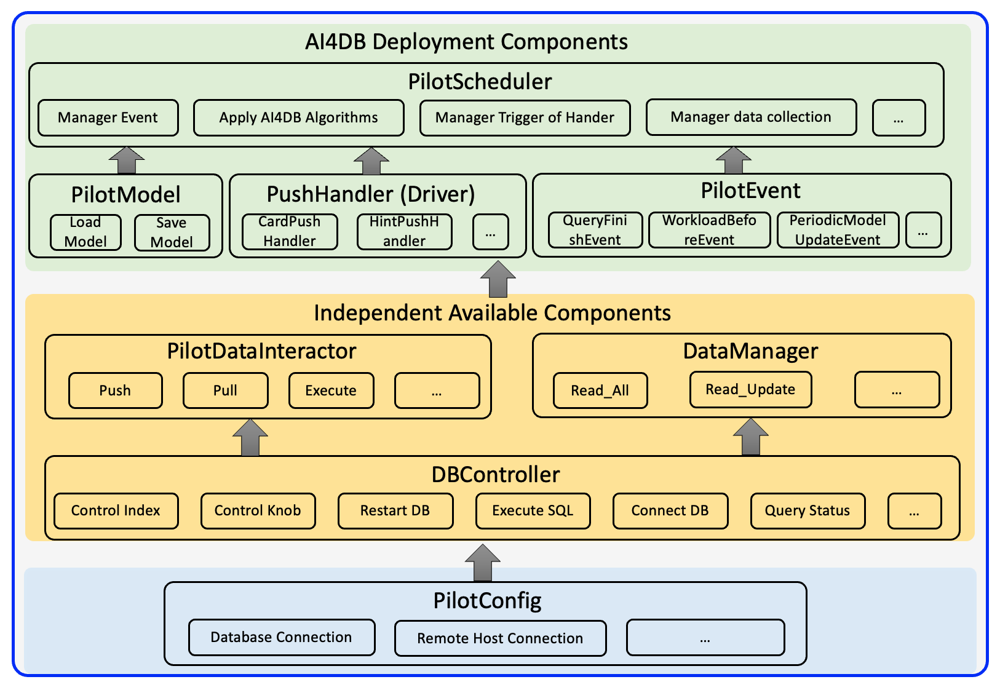

# <center><font color=green size=10>PilotScope</font></center>

<div style="text-align:center">
  
</div>


 


**PilotScope** is a middleware to bridge the gaps of deploying AI4DB (Artificial Intelligence for Databases) algorithms
into actual database systems. It aims at hindering the underlying details of different databases so that an AI4DB driver
could steer any database in a unified manner. By applying PilotScope, we obtain the following benefits:

* The DB users could experience any AI4DB algorithm as a plug-in unit on their databases with little cost. The cloud
  computing service providers could operate and maintain AI4DB algorithms on their database products as a service to
  users. **(More Convenient for Usage! 👏👏👏)**

* The ML researchers could easily benchmark and iterate their AI4DB algorithms in practical scenarios. **(Much Faster to
  Iterate! ⬆️⬆️⬆️)**

* The ML and DB developers are liberated from learning the details in other side. They could play their own strengthes
  to write the codes in their own sides. **(More Freedom to Develop! 🏄‍♀️🏄‍♀️🏄‍♀️)**


* All contributors could extend PilotScope to support more AI4DB algorithms, more databases and more functions. **(We
  highly encourage this! 😊😊😊)**

| [Code Structure](#code-structure) | [Quick Start](#quick-start) | [Core Components](#core-components)
 [Documentation](#documentation) | [License](#license) | [Publication](#publications)
| [Contributing](#contributing) |

---
**News**

* 🎉 [2023-12-15] Our **[paper](https://)** on PilotScope has been accepted by VLDB 2024!

---
<!-- ## News -->

## Code Structure

```
PilotScope/
├── algorithm_examples                         # Algorithm examples
├── fig                                        # Saved some Figures
├── pilotscope
│   ├── Anchor                                 # Base push and pull anchors for implementing push and pull opearators       
│   │   ├── AnchorHandler.py
│   │   ├── AnchorEnum.py
│   │   ├── AnchorTransData.py
│   │   ├── ...
│   ├── Common                                 # Useful tools for PilotScope
│   │   ├── Index.py
│   │   ├── CardMetricCalc.py                   
│   │   ├── ...
│   ├── DBController                           # The implemenation of DB controllers for different databased
│   │   ├── BaseDBController.py
│   │   ├── PostgreSQLController.py
│   │   ├── ...
│   ├── DBInteractor                           # The funtionalities for interaction with database
│   │   ├── HttpInteractorReceiver.py
│   │   ├── PilotDataInteractor.py
│   │   ├── ...
│   ├── DataManager                            # The management of data
│   │   ├── DataManager.py
│   │   └── TableVisitedTracker.py
│   ├── Dataset                                # An easy-to-use API for loading benchmarks
│   │   ├── BaseDataset.py
│   │   ├── Imdb
│   │   ├── ...
│   ├── Exception                              # Some exception which may occur in the lifecycle of pilotscope
│   │   └── Exception.py
│   ├── Factory                                # Factory patterns
│   │   ├── AnchorHandlerFactory.py
│   │   ├── DBControllerFectory.py
│   │   ├── ...
│   ├── PilotConfig.py                         # Configurations of PilotScope
│   ├── PilotEnum.py                           # Some related enumeration types
│   ├── PilotEvent.py                          # Some predefined events
│   ├── PilotModel.py                          # Base models of pilotscope 
│   ├── PilotScheduler.py                      # Sheduling data traing、inference、collection push-and-pull and so on
│   ├── PilotSysConfig.py                      # System configuration of PilotScope 
│   └── PilotTransData.py                      # A unified data object for data collection
├── requirements.txt                           # Requirements for PilotScope
├── setup.py                                   # Setup for PilotScope
├── test_example_algorithms                    # Examples of some tasks, such as index recommendation, knob tuning, etc.
└── test_pilotscope                            # Unittests of PilotScope
```

## Installation
You can install PilotScope Core and modified databases (e.g., PostgreSQL and Spark) following
the [documentation](https://woodybryant.github.io/PilotScopeDoc.io/).

## Feature Overview

The components of PilotScope Core in ML side can be divided into two categories: Database Components and Deployment
Components. The Database Components are used to facilitate data exchange and control over database, while the Deployment
Components are used to facilitate the automatic application of custom AI algorithms to each incoming SQL query.

A high-level overview of the PilotScope Core components is shown in the following figure.

<div align="center">
  
</div>

The Database Components are highlighted in Yellow, while the Deployment Components are highlighted in green. We will
discuss each of these components in detail in the [documentation](https://woodybryant.github.io/PilotScopeDoc.io/).

### An Example for Data Interaction with Database
The `PilotConfig` class is utilized to configure the PilotScope application, such as the database credentials for
establishing a connection.
We first create an instance of the PilotConfig where we can specify the database credentials and connected database
name, i.e., stats_tiny.

```python
# Example of PilotConfig
config: PilotConfig = PostgreSQLConfig(host="localhost", port="5432", user="postgres", pwd="postgres")
# You can also instantiate a PilotConfig for other DBMSes. e.g. 
# config:PilotConfig = SparkConfig()
config.db = "stats_tiny"
# Configure PilotScope here, e.g. changing the name of database you want to connect to.
```

The PilotDataInteractor class provides a flexible workflow for data exchange. It includes three main functions: `push`,
`pull`, and `execute`.
These functions assist the user in collecting data (pull operators) after setting additional data (push operators) in a
single query execution process.

For instance, if the user wants to collect the execution time, estimated cost, and cardinality of all sub-queries within
a query. Here is an example code:

```python
sql = "select count(*) from votes as v, badges as b, users as u where u.id = v.userid and v.userid = b.userid and u.downvotes>=0 and u.downvotes<=0"
data_interactor = PilotDataInteractor(config)
data_interactor.pull_estimated_cost()
data_interactor.pull_subquery_card()
data_interactor.pull_execution_time()
data = data_interactor.execute(sql)
print(data)
```

The `execute` function returns a `PilotTransData` object named `data`, which serves as a placeholder for the collected
data.
Each member of this object represents a specific data point, and the values corresponding to the previously
registered `pull` operators will be filled in, while the other values will remain as None.

```
execution_time: 0.00173
estimated_cost: 98.27
subquery_2_card: {'select count(*) from votes v': 3280.0, 'select count(*) from badges b': 798.0, 'select count(*) from users u where u.downvotes >= 0 and u.downvotes <= 0': 399.000006, 'select count(*) from votes v, badges b where v.userid = b.userid;': 368.609177, 'select count(*) from votes v, users u where v.userid = u.id and u.downvotes >= 0 and u.downvotes <= 0;': 333.655156, 'select count(*) from badges b, users u where b.userid = u.id and u.downvotes >= 0 and u.downvotes <= 0;': 425.102804, 'select count(*) from votes v, badges b, users u where v.userid = u.id and v.userid = b.userid and u.downvotes >= 0 and u.downvotes <= 0;': 37.536205}
buffercache: None
...
```

In certain scenarios, when the user wants to collect the execution time of a SQL query after applying a new
cardinality (e.g., scaling the original cardinality by 100) for all sub-queries within the SQL,
the PilotDataInteractor provides push function to achieve this.
Here is an example code:

```python
# Example of PilotDataInteractor (registering operators again and execution)
data_interactor.push_card({k: v * 100 for k, v in data.subquery_2_card.items()})
data_interactor.pull_estimated_cost()
data_interactor.pull_execution_time()
new_data = data_interactor.execute(sql)
print(new_data)
```

By default, each call to the execute function will reset any previously registered operators.
Therefore, we need to push these new cardinalities and re-register the pull operators to collect the estimated cost and
execution time.
In this scenario, the new cardinalities will replace the ones estimated by the database's cardinality estimator.
As a result, the partial result of the `new_data` object will be significantly different from the result of the `data`
object,
mainly due to the variation in cardinality values.

```
execution_time: 0.00208
estimated_cost: 37709.05
...
```
More functionalities please refer to the [documentation](https://woodybryant.github.io/PilotScopeDoc.io/).


## Documentation

The classes and methods of PilotScope have been well documented. You can find the documentation
in [documentation](https://woodybryant.github.io/PilotScopeDoc.io/).

## License

PilotScope is released under Apache License 2.0.

## References

If you find our work useful for your research or development, please kindly cite the following
```
```

## Contributing

As an open-sourced project, we greatly appreciate any contribution to PilotScope! 